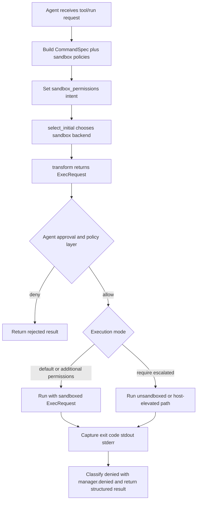

# Usage Guide

Library version: `v0.7.0`
Release notes: [CHANGELOG.md](../CHANGELOG.md)

## Table of Contents

- [Purpose](#purpose)
- [What Your Agent Must Provide](#what-your-agent-must-provide)
- [Quick Start](#quick-start)
- [Planning Flow](#planning-flow)
- [Execution Flow Diagram](#execution-flow-diagram)
- [Approval And Elevation Decision Point](#approval-and-elevation-decision-point)
- [What `CommandSpec` Is](#what-commandspec-is)
- [Type Ownership](#type-ownership)
- [Transform Inputs And Outputs](#transform-inputs-and-outputs)
- [Handling Restricted Actions](#handling-restricted-actions)
- [Policy Selection](#policy-selection)
- [Path-Scoped Filesystem Restrictions](#path-scoped-filesystem-restrictions)
- [Limited Network Behavior](#limited-network-behavior)
- [Platform Integration Notes](#platform-integration-notes)
- [Advanced Policy Patterns](#advanced-policy-patterns)
- [Optional Global Configuration](#optional-global-configuration)
- [Minimal Runner Contract](#minimal-runner-contract)

## Purpose

Use this library to plan sandboxed command execution for a Crystal agent runtime.
It decides sandbox backend, transforms high-level command intent into an executable
request, and exposes helper APIs for Linux/macOS/Windows sandbox behavior.

The library does not run your subprocess for you.

## What Your Agent Must Provide

Your agent/orchestrator is responsible for:

- Building `CommandSpec` from tool call intent (`program`, `args`, `cwd`, `env`, permissions, justification).
- Selecting policies (`FileSystemSandboxPolicy`, `NetworkSandboxPolicy`, preference, Windows sandbox level).
- Supplying platform-specific executable/runtime inputs:
  - Linux: `linux_sandbox_exe` when using `SandboxType::LinuxSeccomp`.
  - macOS: host must provide `/usr/bin/sandbox-exec`.
  - Windows: host must support restricted-token execution and any required setup APIs.
- Executing the resulting `ExecRequest` (`command`, `env`, `cwd`) with your process runner.
- Capturing stdout/stderr/exit code and classifying denials via `manager.denied(...)`.
- Applying your own timeout, cancellation, retries, streaming, and audit logging policies.

## Quick Start

```crystal
require "sandbox"

manager = Sandbox::Sandboxing.new

fs_policy = Sandbox::Sandboxing::FileSystemSandboxPolicy.restricted
net_policy = Sandbox::Sandboxing::NetworkSandboxPolicy::Restricted

sandbox_type = manager.select_initial(
  fs_policy,
  net_policy,
  Sandbox::Sandboxing::SandboxPreference::Auto,
  Sandbox::Sandboxing::WindowsSandboxLevel::Disabled,
  false
)

request = manager.transform(
  Sandbox::Sandboxing::CommandSpec.new(
    program: "echo",
    args: ["hello"]
  ),
  fs_policy,
  net_policy,
  sandbox_type,
  linux_sandbox_exe: "/usr/local/bin/agent-linux-sandbox",
  use_linux_sandbox_bwrap: true
)
```

## Planning Flow

1. Build `CommandSpec` from user/tool intent.
2. Set `sandbox_permissions` intent (`"use_default"`, `"with_additional_permissions"`, or `"require_escalated"`).
3. Compute `sandbox_type` via `select_initial(...)`.
4. Call `transform(...)` to produce `ExecRequest`.
5. Apply your own approval/policy decision for sandbox override or escalation.
6. Execute the approved request with your own runner.
7. Use `denied(...)` + exit code/stderr to classify policy denials.

## Execution Flow Diagram



## Approval And Elevation Decision Point

After `transform(...)`, your agent policy layer should decide whether to run:

- Sandboxed (`ExecRequest` as produced).
- Sandboxed with additional scoped permissions.
- Unsandboxed/host-elevated (when requested and approved).

This decision is runtime-specific and intentionally outside this library.

## What `CommandSpec` Is

`CommandSpec` is the pre-sandbox command intent for a single tool/process
execution request. Your agent builds this first, then passes it to
`manager.transform(...)`.

Fields:

- `program` (`String`): executable name/path to invoke.
- `args` (`Array(String)`): argv values after `program`.
- `cwd` (`String`): working directory for execution.
- `env` (`Hash(String, String)`): environment variables for the process.
- `expiration` (`Int64?`): optional runtime timeout/expiration hint (milliseconds).
- `sandbox_permissions` (`String`): sandbox mode hint (default: `"use_default"`).
- `justification` (`String?`): optional reason text for elevated actions.

Expected `sandbox_permissions` values your agent policy layer should interpret:

- `"use_default"`: run with turn/session sandbox defaults.
- `"with_additional_permissions"`: stay sandboxed but widen scoped permissions for this command.
- `"require_escalated"`: request unsandboxed or host-elevated execution path.

This library passes the value through into `ExecRequest`. Approval, prompting, and
final elevated execution decisions are handled by your agent runtime/policy layer.

Example:

```crystal
spec = Sandbox::Sandboxing::CommandSpec.new(
  program: "echo",
  args: ["hello"],
  cwd: "/tmp",
  env: {"LANG" => "C"},
  expiration: 30_000_i64,
  sandbox_permissions: "use_default",
  justification: nil
)
```

## Type Ownership

The library defines both `CommandSpec` and `ExecRequest`.

- You provide `CommandSpec` as input to `manager.transform(...)`.
- The library returns `ExecRequest` from `manager.transform(...)`.

Definitions:

- [CommandSpec](../src/sandbox/sandboxing.cr)
- [ExecRequest](../src/sandbox/sandboxing.cr)

## Transform Inputs And Outputs

### Input (`CommandSpec` + policy)

- `CommandSpec` carries command/env/cwd and metadata.
- Filesystem/network policies define target sandbox restrictions.
- `SandboxType` determines wrapping strategy by platform.

### Output (`ExecRequest`)

- `request.command`: fully wrapped argv (if sandbox enabled).
- `request.env`: env including policy-driven entries.
- `request.cwd`: working directory for spawn.
- `request.expiration`: optional expiration/timeout hint propagated from `CommandSpec`.
- `request.arg0`: optional argv0 override metadata.

`transform(...)` is a planning step and generally returns an `ExecRequest` even if
execution will later be denied.

## Handling Restricted Actions

A restricted action is usually observed at runtime:

- non-zero exit code
- denial-related stderr text

Example classification pattern:

```crystal
status = Process.run(
  request.command.first,
  args: request.command[1..],
  env: request.env,
  chdir: request.cwd,
  output: STDOUT,
  error: STDERR
)

exit_code = status.exit_code
stderr_text = "" # capture from your stderr buffer/pipe
denied = manager.denied(sandbox_type, stderr_text, exit_code)
```

## Policy Selection

- `SandboxPreference::Auto`: choose based on policy + platform.
- `SandboxPreference::Require`: force platform sandbox backend.
- `SandboxPreference::Forbid`: no sandbox wrapping.

Typical outcomes:

- Restricted FS + restricted network in `Auto`: usually sandboxed backend.
- Unrestricted FS + enabled network in `Auto`: often `SandboxType::None`.

## Advanced Policy Patterns

For concrete path-scoped filesystem and limited-network patterns grounded in
upstream Rust behavior, see:

- [Policy Patterns](policy-patterns.md)

## Platform Integration Notes

### Linux

- Provide `linux_sandbox_exe` when using Linux seccomp sandbox transforms.
- `codex_linux_sandbox_exe` remains as backward-compatible alias.
- `use_linux_sandbox_bwrap: true` enables bwrap-style wrapping.
- Optional global defaults:
  - `LinuxSandbox.default_linux_sandbox_exe`
  - `LinuxSandbox.proxy_socket_dir_prefix`

### macOS

- Seatbelt integration uses `/usr/bin/sandbox-exec`.
- Policy generation is done by `MacosSeatbelt` helper integration.

### Windows

- Uses restricted-token sandbox behavior from `WindowsSandbox` module.
- Optional runtime defaults:
  - `WindowsSandbox.sandbox_home`
  - `WindowsSandbox.sandbox_users_group`
  - `WindowsSandbox.offline_username`
  - `WindowsSandbox.online_username`
- Windows-only helper APIs fail fast on non-Windows hosts.
- `run_windows_sandbox_capture(...)` returns `CaptureResult` with `exit_code`, `stdout`, `stderr`.

## Optional Global Configuration

```crystal
Sandbox::Sandboxing::WindowsSandbox.sandbox_home = "/var/lib/my-agent/sandbox-state"
Sandbox::Sandboxing::WindowsSandbox.sandbox_users_group = "AgentSandboxUsers"
Sandbox::Sandboxing::WindowsSandbox.offline_username = "AgentSandboxOffline"
Sandbox::Sandboxing::WindowsSandbox.online_username = "AgentSandboxOnline"

Sandbox::Sandboxing.sandbox_env_var = "AGENT_SANDBOX"
Sandbox::Sandboxing.network_disabled_env_var = "AGENT_SANDBOX_NET_DISABLED"

Sandbox::Sandboxing::LinuxSandbox.default_linux_sandbox_exe = "agent-linux-sandbox"
Sandbox::Sandboxing::LinuxSandbox.proxy_socket_dir_prefix = "agent-linux-sandbox-proxy-"
```

## Minimal Runner Contract

At minimum your agent runtime should do all of the following:

- Build and validate `CommandSpec`.
- Convert to `ExecRequest` using `select_initial` + `transform`.
- Execute command with exact `env` and `cwd` from the request.
- Capture exit code/stderr and classify denial with `manager.denied(...)`.
- Return structured result to caller (stdout/stderr/exit code/denied flag).

## Related Docs

- [Architecture](architecture.md)
- [Development](development.md)
- [Testing](testing.md)
